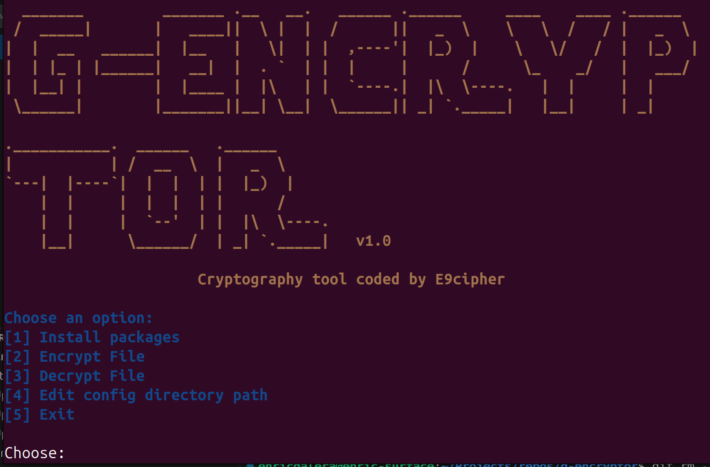

# G-encryptor
## Overview
This project coded in python allows the user to encrypt/decrypt files in a specified directory.
## Modes
There are two modes, the user-friendly and the machine-friendly.
### User-friendly
Displays the menu, logo and options for user to select. Outputs every change it makes, including deletions, encryptions and decryptions
```bash
./g-encryptor.sh
```
and this will display the menu with its options



### Machine-friendly
This is a mode which a script can call the file, pass an argument (encrypt/decrypt) and the script will do the thing
```bash
./g-encryptor.sh encrypt
./g-encryptor.sh decrypt
```
that will encrypt/decrypt the specified directory (`TARGET_DIR`)
## Usage
If you are in user mode, run just `./g-encryptor.sh`. If it is running on machine mode, run `./g-encryptor <encrypt|decrypt>`. Make sure that the configuration file (`config.ini`) has the `target_dir` variable set and **does not finish with a final /**. This is important as the script won't be able to handle paths with an ending slash. I've added filters to strip the slash when the `target_dir` changes.
## Options
1. **Install packages**: This allows to install the requried packages for the script to run properly. You should run it at least once. In the `bin` branch the files have been compiled to binary to prevent this.
2. **Encrypt**: This encrypts all files in the `target_dir` directory recursively except the ones with the `GNOENCRYPT` flag (see GNOENCRYPT flag below).
3. **Decrypt**: This decrypts all files in the `target_dir` directory recursively except the ones with the `GNOENCRYPT` flag.
4. **Change config directory path**: This allows to change the `target_dir` variable by directly writing to `$CONFIG_FILE` (defined in line 5 of `g-encryptor.sh`), normally `config/config.ini`.
5. **Exit**: Exits the script.
## GNOENCRYPT flag
The text "GNOENCRYPT" has been introduced in all files required by this program. This prevents `encrypt.py` or `decrypt.py` to touch or corrupt the files.
## Other requirements
File `server.php` must be avaliable in `$seed_url` (defined in `encrypt.py` line 13) for the decryption of the files. The current url is `localhost:80/banana/index.php` and the `hash_pass` with the `now` flag ending must be passed through for the proper decryption. Else, `decrypt.py` will crash.

I'll finish README.md soon
